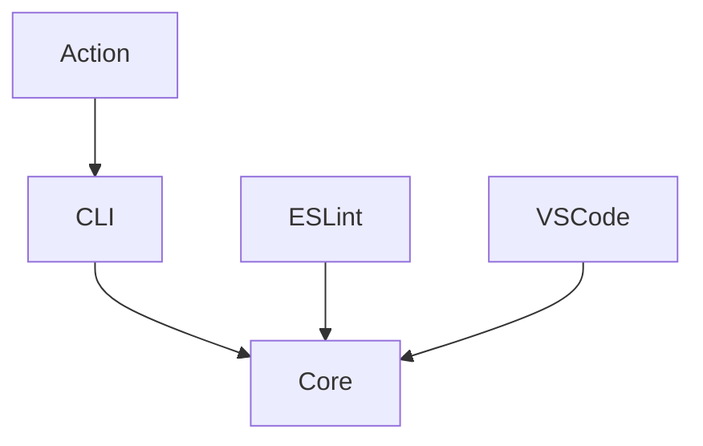

# Grepa Monorepo – Implementation Plan (v1)
<!-- :ga:tldr TypeScript monorepo implementation: parser, CLI, and tooling ecosystem -->
<!-- :ga:spec Version 1 comprehensive implementation plan -->

> **Goal:** Build a TypeScript monorepo that delivers the grepa ecosystem: core parser, CLI, and extensible tooling for editors, linters, and CI/CD integration.

## Implementation Status

- **Phase 1**: ✅ Core package with ripgrep scanner (PR #22)
- **Phase 2**: ✅ CLI with list command (PR #22)
- **Phase 3**: 🚧 Additional CLI commands (grep, lint, stats, format)
- **Phase 4**: 📋 ESLint plugin
- **Phase 5**: 📋 VS Code extension
- **Phase 6**: 📋 GitHub Action

---

## 0 Glossary

| Term          | Meaning                                                                           |
| ------------- | --------------------------------------------------------------------------------- |
| **Anchor**    | A comment‑only token starting with `:ga:` followed by one or more payload tokens. |
| **Grepa**     | The CLI and project namespace (`@grepa/*`).                                       |
| **Workspace** | An npm package managed by pnpm within the repo.                                   |

---

## 1 Repository layout

```text
/grepa (repo root)
│  .grepa.yml          # repo default config
│  .changeset/
│  package.json        # pnpm root, turbo pipeline
│  turbo.json
│  tsconfig.base.json
│
├─ packages/
│   ├─ core/           # @grepa/core
│   ├─ cli/            # @grepa/cli  (npx + binary)
│   ├─ eslint-plugin/  # @grepa/eslint-plugin (optional rules)
│   └─ future/…        # vscode-extension, github-action etc.
└─ scripts/            # release helpers, pre‑commit hook templates
```

### 1.1 Workspaces

| Package                  | Purpose                                               | Out‑dir                                        | Publish target        |
| ------------------------ | ----------------------------------------------------- | ---------------------------------------------- | --------------------- |
| **@grepa/core**          | Anchor parser, AST utils, shared regex, config loader | `dist/` (esm/cjs)                              | npm                   |
| **@grepa/cli**           | User‑facing binary invoking core                      | `bin/grepa.js`; esbuild'ed binaries in `dist/` | npm + GitHub Releases |
| **@grepa/eslint-plugin** | Optional lint rules that piggy‑back on core parser    | `dist/`                                        | npm                   |

---

## 2 Tooling Stack

| Concern                 | Choice                                                          |
| ----------------------- | --------------------------------------------------------------- |
| **Package mgr**         | **pnpm** (workspace protocol)                                   |
| **Build orchestration** | **Turborepo** tasks: `build`, `lint`, `test`, `release`         |
| **Compiler**            | ts‑node for dev, **Bun** for production bundles and binaries    |
| **CI**                  | GitHub Actions (install pnpm, run turbo pipeline, publish)      |
| **Versioning**          | Semantic Versioning; **Changesets** automates changelogs & tags |

---

## 3 Anchor grammar (core)

```bnf
anchor   ::= ":ga:" payload
payload  ::= token ( sep token )*
token    ::= bare | json | array
bare     ::= "@"? [A-Za-z0-9_.-]+   # sec, perf, @cursor, v=0.3
json     ::= "{" … "}"
array    ::= "[" … "]"
sep      ::= "," | "|" | whitespace+
```

Reserved tags (v0):

* `sec`  – security sensitive (warn)
* `perf` – performance hotspot (allow)
* `temp` – temporary hack (block on `lint`)
* `debug` – debug‑only (block)
* `placeholder` – stub (allow)
* `v=` / `since=` – version metadata (warn if < pkg.version)

See `docs/syntax.md` for the full token list including conventional commit types and extended categories.

---

## 4 CLI (`grepa`)

### 4.1 Resolution order

1. `--anchor <sigil>` flag
2. Repo `.grepa.yml` (nearest upward)
3. `$GREPA_ANCHOR` env var
4. Default `:ga:`

### 4.2 Commands

| Command                | Aliases | Description                                                                                                                  |
| ---------------------- | ------- | ---------------------------------------------------------------------------------------------------------------------------- |
| `grepa list`           | `ls`    | Print unique anchor tags. Flags: `--json`, `--count`.                                                                      |
| `grepa grep <pattern>` |         | Ripgrep constrained to anchors. Inherits rg flags + `--files`. Adds value by respecting .grepa.yml excludes and scoping to anchor lines only. |
| `grepa lint`           |         | Enforce policy. Flags: `--forbid`, `--max-age <days>`, `--ci`.                                                               |
| `grepa stats`          |         | Histogram by tag. Flags: `--top N`, `--since <version>`.                                                                   |
| `grepa format`         |         | Rewrite conventional comment leaders (e.g., `TODO`, `FIXME`) into anchor syntax. Supports `--dry-run`, `--comment-style <c|xml|hash>`. |

### 4.3 Distribution

* **npm**: `npx grepa …` (requires Node ≥ 18).
* **Standalone binaries** via Bun compile for macOS x64, macOS arm64, Linux x64, Linux arm64, Windows x64. Published as GitHub release assets; Homebrew formula taps macOS binary.

---

## 5 Config file `.grepa.yml`

```yaml
anchor: ":ga:"            # override sigil (optional)
files:
  include: ["*.{ts,js,tsx}"]
  exclude: ["dist/**"]
lint:
  forbid: ["temp", "debug"]
  maxAgeDays: 90
  versionField: "since"     # or "v"
dictionary:
  sec: Security‑sensitive code
  perf: Performance hotspot
```

If absent, CLI uses built‑ins and scans all non‑gitignored files.

---

## 6 Pre‑commit hooks (templates)

Scripts in `/scripts/hooks` showcase:

1. `grepa lint --ci` – fail commit if forbidden anchors present.
2. `grepa format --staged` – convert TODO → anchor on staged files.
   Users can symlink via Husky or lefthook.

---

## 7 Pipeline summary (GitHub Actions)

#### Not shipped in v0, but outlined for future reference

* `ci.yml` → install pnpm, turbo build+test, run `grepa lint --ci`.
* `release.yml` → triggered by Changesets, builds binaries, publishes to npm, attaches release assets.

---

## 8 Runtime & compatibility

| Component        | Minimum                                       | Notes                                       |
| ---------------- | --------------------------------------------- | ------------------------------------------- |
| Core / CLI (npm) | **Node 18**                                   | Tested on 18 LTS & 20 LTS                   |
| Binaries         | macOS x64/arm64, Linux x64/arm64, Windows x64 | Built with Bun; no runtime required         |

---

## 9 Detailed Implementation Phases

### Phase 1: Core Package (✅ Complete)
**Package**: `@grepa/core`
**Status**: Implemented in PR #22

Features:
- Ripgrep-based scanner for finding `:ga:` patterns
- Match processor for parsing anchor payloads
- Configuration loader with Zod validation
- TypeScript types for all data structures
- Report generator for inventory output

### Phase 2: Basic CLI (✅ Complete)
**Package**: `@grepa/cli`
**Status**: Implemented in PR #22

Features:
- Commander.js-based CLI structure
- `grepa list` command with multiple output formats
- Configuration file support (`.grepa.json`)
- Error handling and user-friendly output

### Phase 3: Extended CLI Commands (🚧 In Progress)
**Timeline**: 2-3 weeks

#### `grepa grep <pattern>`
- Wrapper around ripgrep focused on anchor lines
- Respects `.grepa.yml` excludes
- Supports all ripgrep flags plus custom filtering

#### `grepa lint`
- Policy enforcement (forbid certain tags)
- Age checking (warn on old anchors)
- CI mode with non-zero exit codes
- Custom rules via configuration

#### `grepa stats`
- Tag frequency analysis
- File and directory distribution
- Trend analysis over time
- Export to JSON/CSV for visualization

#### `grepa format`
- Convert TODO/FIXME to grep-anchors
- Support multiple comment styles
- Dry-run mode for safety
- Configurable transformation rules

### Phase 4: ESLint Plugin (📋 Planned)
**Package**: `@grepa/eslint-plugin`
**Timeline**: 3-4 weeks

Features:
- Rule: `grepa/no-forbidden-tags` - Block specific anchor types
- Rule: `grepa/max-age` - Warn on anchors older than X days
- Rule: `grepa/require-description` - Ensure anchors have descriptions
- Rule: `grepa/valid-syntax` - Validate anchor format
- Auto-fix support where applicable

### Phase 5: VS Code Extension (📋 Planned)
**Package**: `grepa-vscode`
**Timeline**: 4-6 weeks

Features:
- Syntax highlighting for `:ga:` patterns
- IntelliSense for known tags
- CodeLens showing anchor counts
- Quick actions (convert TODO, add anchor)
- Sidebar panel with anchor inventory
- Go-to-definition for anchor references

### Phase 6: GitHub Action (📋 Planned)
**Timeline**: 2-3 weeks

Features:
- Pre-built action for CI/CD pipelines
- Configurable policies
- PR comments with anchor summaries
- Fail builds on policy violations
- Generate anchor reports as artifacts

## 10 Technical Architecture

### Core Design Principles
1. **Modular**: Each package has a single responsibility
2. **Extensible**: Plugin architecture for custom rules/formats
3. **Fast**: Leverage ripgrep for performance
4. **Type-safe**: Full TypeScript with strict mode
5. **Testable**: Comprehensive test coverage with Vitest

### Package Dependencies


### Configuration Schema
```typescript
interface GrepaConfig {
  anchor?: string;           // Default: ":ga:"
  files?: {
    include?: string[];      // Glob patterns
    exclude?: string[];      // Glob patterns
  };
  lint?: {
    forbid?: string[];       // Forbidden tags
    maxAgeDays?: number;     // Age limit
    require?: string[];      // Required tags
  };
  format?: {
    rules?: FormatRule[];    // Custom transformations
  };
  dictionary?: Record<string, string>; // Tag descriptions
}
```

## 11 Testing Strategy

### Unit Tests
- Parser edge cases
- Configuration validation
- Output formatting
- Error scenarios

### Integration Tests
- CLI command execution
- File system operations
- Cross-platform compatibility

### Performance Tests
- Large repository scanning
- Memory usage profiling
- Benchmark against raw ripgrep

## 12 Distribution Strategy

### NPM Packages
- Automated publishing via changesets
- Semantic versioning
- Detailed changelogs

### Standalone Binaries
- Built with Bun for all major platforms
- GitHub Releases with checksums
- Homebrew formula for macOS
- Scoop manifest for Windows

### Docker Image
- Alpine-based minimal image
- Multi-arch support (amd64, arm64)
- CI/CD integration ready

## 13 Success Metrics

- **Adoption**: Number of repositories using grepa
- **Performance**: Scan time vs raw ripgrep (target: <20% overhead)
- **Reliability**: Test coverage >90%
- **Usability**: CLI help rating, documentation clarity
- **Ecosystem**: Number of third-party integrations

## 14 Migration Path

### From v0 (ripgrep-only) to v1 (tooling)
1. Install CLI: `npm install -g @grepa/cli`
2. Generate initial config: `grepa init`
3. Run inventory: `grepa list`
4. Add linting: `grepa lint --dry-run`
5. Integrate with CI/CD

### For Existing Codebases
1. Start with `grepa format` to convert TODOs
2. Review and adjust generated anchors
3. Add `.grepa.yml` for team conventions
4. Enable ESLint plugin incrementally
5. Roll out VS Code extension to team

---

### End of Implementation Plan v1